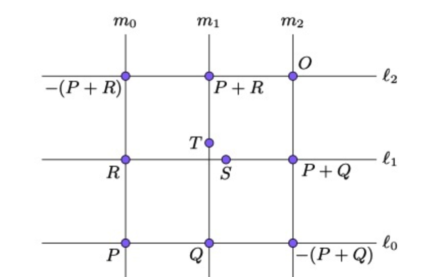

## 引言

本文档仅是自己《区块链编程》的笔记，不保证都正确，仅用以互相交流学习

## 第一章 有限域

#### 有限域

- 加减乘除封闭，且对任何一个数存在加法和乘法逆元，存在0和1满足加法和乘法恒等（这里的加减乘除不一定是常规意义上的，如椭圆曲线加法是交点关于x轴的对称）
- 阶为质数，这是为了确保除法成立（否则若存在 `a!=0, b!=0, a*b%p=p=0` 推出 `a=0 或 b=0`，这显然是矛盾的)
- 模运算是构建有限域的方式之一
- 模运算的`+-*`比较符合直觉，但`/`比较反直觉。通常利用费马小定理 `n^(p-1)%p = 1` 来将除法转化为乘法进行计算（`a/b = a*b^-1 = a*b^(p-2)`)

#### 费马小定理的简单证明

- `{1,2,..p-1}={1n,2n,..(p-1)n}`，原因是若任意俩数 `a*n=b*n => (a-b)*n%p=0` 在 p 为质数时无法成立，因此`{1n,2n,..(p-1)n}`中任意俩数必然不同，而可用空位又只有 p 个，因此两个集合相同只是排列顺序不同
- 将两个集合中的所有数累乘得 `(p-1)!%p = (p-1)! * n^(p-1) %p => 1%p=n^(p-1)%p`

#### 问题合集

- 为什么 `有限域` 很重要?
    - 答：计算机的存储量是有限的，而 `实数域等式` 在有限域内运用 `加减乘除` 后依然使等式成立，因此可将实数内的运算放入计算机
- 为什么 `有限域` 内的除法很重要？
    - 答：有限域内的乘法必须存在逆元，因此必须有除法
- 为什么要理解 `费马小定理`?
    - 答：`模运算下的有限域` 的除法可用 `费马小定理` 转为乘法运算，简单且避免了整数除法带来的 `分数难以存储` 的问题

## 第二章 椭圆曲线

#### 椭圆曲线的重要性质

- 在曲线上任取两个点，连成直线后必然会与曲线相交于第三个点（无穷远也算交点，切点算两个点），直观上像是天然提供了 `A+B=C` 的加法定义

#### 椭圆曲线点加法的重要性质

- 点加法为非线性的，结果很难预测，
- 点加法的定义满足 `封闭性、可逆性、单位元、逆元、结合律、交换律` 即 `群` 的性质，简单说可以按我们的习惯进行加法运算（换顺序、套括号等）

#### 椭圆曲线点加法的结合律证明（可跳过）

点加法满足群要求中，`结合律`是比较难以证明的，以下给出简单的论证：

1. 已知 R、P、-(P+R) 在同一直线上，如下图。同理可画出剩余所有直线

2. 利用 `Cayley-Bacharach定理`（==这个定理在有空时再学习，知道结论即可==）：射影平面内，任意两条不同的平面三次曲线会相交于9点（相切算两点），那么如果第三条不同的平面三次曲线经过了其中任意8点，则它必然经过第九点
3. 取 `l1*l2*l3=0` 为三次曲线A、`m1*m2*m3=0` 为三次曲线B，A和B分别与椭圆曲线相交于8个点（这也是为什么选出两组彼此不相交的三条线的原因），基于上述定理，得出 `T=S` 即 `结合律` 得到证明

#### 问题合集

- 为什么点加法的结果要关于 x 轴对称？
    - 答：若不关于 x 轴对称的话，那么 `A+B=C; A+C=B;` 推出 `A+A+B=B 即 A+A=0` 这显然是自相矛盾的定义。而关于 x 轴对称后，发现这个定义刚好符合 `群` 的定义，因此可用
- 为什么椭圆曲线加法的结合律很重要？
    - 答：点加法的结合律，可使 `标量乘法` 的计算复杂度降低到 `log(n)`（`倍加算法`），而暴力破解时为 `n`，这也是椭圆曲线公钥算法可用的关键

## 第三章 椭圆曲线密码学

#### 有限域下的椭圆曲线

实数域和有限域的性质是一样的，而椭圆曲线也可以在任何域上使用点加法，因而可以应用于有限域

#### 有限循环群

点的标量乘法经过一定次数后，会得到无穷远点。因此标量乘法的结果会形成一个集合，称为 `有限循环群`

#### 有限循环群的重要性

为了公钥密码学，我们真正想要的就是 `有限循环群`. 而这可以通过在有限域的椭圆曲线上选一个点作为 `起点`，利用标量乘法构成 `有限循环群`

其中 `群` 不像域，在满足封闭性、可逆性、交换律及结合律的情况下，只需要一个运算符即可

#### 问题合集

- 实数域中 y=0 只有一点，而到有限域后，y=0 就有很多点了。对这些 `点的平方` 都作为无穷来解释合理吗？
    - 答：有限域中 y=0 并不一定非要和实数域中的值对应起来，可以理解为在有限域中把这些点都作为特殊点处理，只要点加法的特性依然保持住即可
- 如何证明标量乘法一定会形成`有限循环群`？
    - 答：有限域上的点是有限个，标量乘法的结果 `(1*p, 2*p..n*p)`必然也是有限个，n可以无穷而值却有限，说明必然存在一个环，因而必然存在 n 使 `n*p=infinity` 成立，进而形成有限循环群
- 为什么 `有限循环群` 才是公钥密码学的关键？（应该还有其他用处，欢迎补充？）
    1. 确保了校验签名的过程能始终在 n 的域中进行，即可在有限位内合法计算
    2. 这样当标量乘法中的标量及其巨大时，可以取余来减小工作量，以及确保私钥可以存储进指定范围内
- 计算签名时，域从 P 变成了 N，为什么这是合理的转换？
    - 答：类似实数到有限域，是单向映射，不是 `互相转换` 关系。在新的域下利用该公式来计算值，只要签名出来的值能够正确的验签即可，不需要跟其他域做对应关系
- 如何判断比特币私钥是否合法？范围怎么规定？
    - 答：理论上任何数字都是合法的，但是超过 `有限循环群的阶` 后等同于 `small_priv = large_priv % N`，因此合法范围就规定在 `0~N` 之间
- 比特币中的签名 `sig` 为什么必须小于 n/2?
    - 答：验证签名时，域为 `n` 即 `n * G = infinity`。所以，`(n-s)*G = n*G - s*G = -s * G`；而在完整验证签名的公式里 `sig = (z + r*e)/k => k*G = (z + r*e)/sig * G;`，如果取 `sig = n - sig` 带入上式，则：`(z + r*e)/(n-sig) * G = -(z + r*e)/sig * G = -kG`，在椭圆曲线上点的负数是关于 x 轴对称的点，即 x 相同，y 不同。在验证签名的最后一步仅仅验证 x 是否等于签名中的 r，因此将 `sig => (n-sig)` 后签名依然有效，带来交易延展性问题。因此比特币后来规定 sig 必须小于 `n/2` 来避免此问题

## 第四章 序列化

#### 问题合集

- 理论上，Signature 按 DER 序列化后的长度可能为 70～72，但为什么当前 BTC 的 Signature 长度始终为 70～71 呢？
    - 答：因为前一章提到 `Signature.s < n/2`，所以 s 一定不是 8 开头也就不需要补充 `00` 前缀
